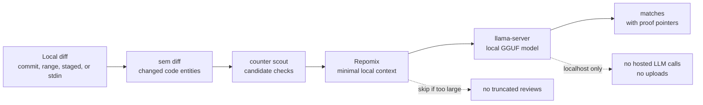

# Stupify

[](https://github.com/Octember/stupif.ai/actions/workflows/ci.yml)
[](https://www.npmjs.com/package/@stupify/cli)
[](LICENSE)

[Website](https://stupif.ai) | [npm](https://www.npmjs.com/package/@stupify/cli) | [Releases](https://github.com/Octember/stupif.ai/releases) | [Contributing](CONTRIBUTING.md) | [Security](SECURITY.md)

Local-only diagnostic tooling for checking whether AI is making developers
dumber.

Stupify turns local diffs into compact search evidence, then asks a local model
to look for concrete judgment-offload signals. Your code stays on your machine.

The project is called Stupify. The domain is `stupif.ai`; read it as
"stupify", where the `ai` makes a `y` sound.

## Install

```sh
npx @stupify/cli@latest --commit HEAD
```

Or install it:

```sh
npm install -g @stupify/cli@latest
stupify --commit HEAD
```

Full analysis needs Git, `llama-server`, and a local GGUF model. Run `doctor`
to check the setup:

```sh
stupify doctor
```

## Quickstart

```sh
stupify --commit HEAD          # analyze one commit
stupify --staged               # analyze staged changes
stupify --commits 20           # analyze a recent range
git diff HEAD~1..HEAD | stupify --stdin
```

By default, `stupify` is equivalent to `stupify --since "2 weeks ago"`.

Install the warn-only pre-commit hook:

```sh
stupify hook install
```

The hook runs `stupify --staged` and exits 0.

## How It Works



Stupify emits search `matches`, not audit findings. If the local search input is
too large, it skips instead of reviewing truncated context.

The default search registry enables the checks that currently pass the local
hook-safety bench: `duplicated_schema`, `unnecessary_complexity`,
`over_commenting`, `lint_bypass`, and `reinvented_utils`. Other registry
patterns remain available with `--checks`.

This iteration intentionally does not run findings audit, validators, judges,
baselines, upload data, call hosted LLM APIs, GitHub integration, dashboards, or
repo-wide crawling.

## Requirements

- Node.js 20 or newer for the published CLI.
- Git, because Stupify reads local diffs and commits.
- `llama-server` from `llama.cpp` for local inference.
- A local GGUF model. On first run, Stupify can ask before downloading the
  default model into your local cache.
- Bun 1.3.12 for repository development, tests, and release checks.

On macOS:

```sh
brew install llama.cpp
stupify doctor
```

Setup notes live in [docs/gemma4-llama-cpp.md](docs/gemma4-llama-cpp.md).

## Development

Use the Bun version pinned in `package.json`.

```sh
bun install --frozen-lockfile
bun run check
```

Useful loops:

```sh
bun run typecheck
bun run smoke:cli
```

## Project

- Upgrade with `npm install -g @stupify/cli@latest`.
- Releases use GitHub Releases and npm Trusted Publishing. See
  [docs/releasing.md](docs/releasing.md).
- Contributions are welcome. Read [CONTRIBUTING.md](CONTRIBUTING.md).
- Report security issues through [SECURITY.md](SECURITY.md).

## License

Stupify is released under the [MIT License](LICENSE).
