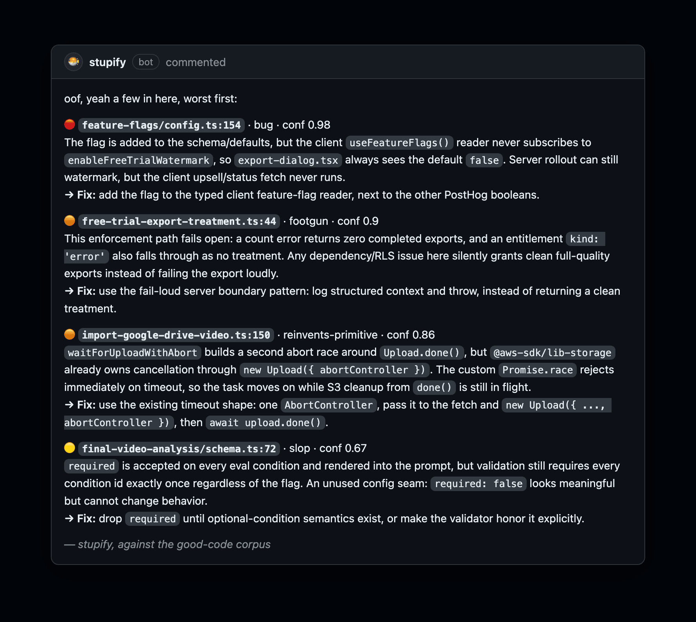

> Debugging is twice as hard as writing the code in the first place. Therefore, if you write the code as
> cleverly as possible, you are, by definition, not smart enough to debug it.
>
> **Kernighan's Law**

# stupify

**AI agents are rats in a maze. They reach for what they know.** And unless you show them better, what they know is slop: [most software is garbage](https://github.com/openai/codex/issues/28224), and they'll [happily](https://github.com/thesysdev/openui/issues/517) [imitate](https://github.com/RsyncProject/rsync/issues/929) [it](https://github.com/anthropics/claudes-c-compiler/issues/1).

[](https://www.npmjs.com/package/@stupify/cli)
[](LICENSE)



*actual issues, tells the coding agent exactly how + what to fix* **[more catches, on real PRs →](docs/PROOF.md)**

### What you get

- **Your taste, not the model's.** Code is judged against a `CORPUS.md`: a [taste pack](#taste-packs) ("code like dtolnay / DHH / antirez …") or your own best files
- **On your personal Codex plan, not an API key.** stupify reviews with [Codex](https://github.com/openai/codex), running on the $20-$200/month plan. API usage is roughly 50x more expensive, enjoy the subsidized tokens while they last
- **Slop, named.** Code review is cheap. Taste is expensive. Codify the goodies, let the LLM pattern match

## Add the reviewer (rides exe.dev, no keys or servers you run)

```bash
npx @stupify/cli
```

```
┌  stupify
◇  using integration acme-widgets
◇  VM stupify-acme-widgets created
└  stupify is provisioned for acme/widgets 👀
```

Stupify rides on [exe.dev](https://exe.dev). Setup takes about two minutes and doesnt require payment

```bash
npx @stupify/cli <owner/repo>          # provision for a specific repo
npx @stupify/cli setup                 # run the reviewer on this machine instead of a VM
npx @stupify/cli status                # show the latest sweep as a workflow
ssh exe.dev rm stupify-<owner>-<repo>  # tear it down
```

Every live sweep also posts a GitHub commit status named `stupify/review` on the PR head commit: pending while
queued/running, success when reviewed or policy-skipped, failure when stupify posts findings, and error when the
reviewer itself failed. Set `GITHUB_STATUS=0` in `~/.stupify/config.env` to turn that off, or
`GITHUB_STATUS_CONTEXT=your/context` to rename it.

### Connect your accounts

The reviews run on Codex. On exe.dev that's a keyless **LLM integration**: it fronts your ChatGPT/Codex plan, so
the VM holds no API key (it bills your plan). Link one once at [exe.dev/integrations](https://exe.dev/integrations)
and provisioning attaches it for you

## Taste packs

Don't have a corpus yet? Borrow one. Pick a programmer whose code you'd point a new hire at and review (and
write) like them, or compose several:

[dtolnay](packs/dtolnay.md) · [DHH](packs/dhh.md) · [antirez](packs/antirez.md) ·
[Sindre Sorhus](packs/sindre-sorhus.md) · [Rich Harris](packs/rich-harris.md) ·
[zod](packs/zod.md) · [Mitchell Hashimoto](packs/mitchell-hashimoto.md) ·
[Tanner Linsley](packs/tanner-linsley.md) · [Simon Willison](packs/simon-willison.md) ·
[devshorts](packs/devshorts.md) · [Jarred Sumner](packs/jarred-sumner.md) · [browse all →](packs)

Each pack is concrete principles plus commit-pinned exemplar files. Or **bring your own**: point stupify at the
files you *wish* all your code looked like, and it scaffolds a `.review/` in your repo:

```bash
npx @stupify/cli init src/best.ts src/clean-service.ts   # inlines them; you add one line of "why" each
```

## License

[MIT](LICENSE) © Noah Lindner. Built by the team at [Bevyl](https://bevyl.ai). `stupif.ai`, read it "stupify". PRs welcome, it'll review them 😈
