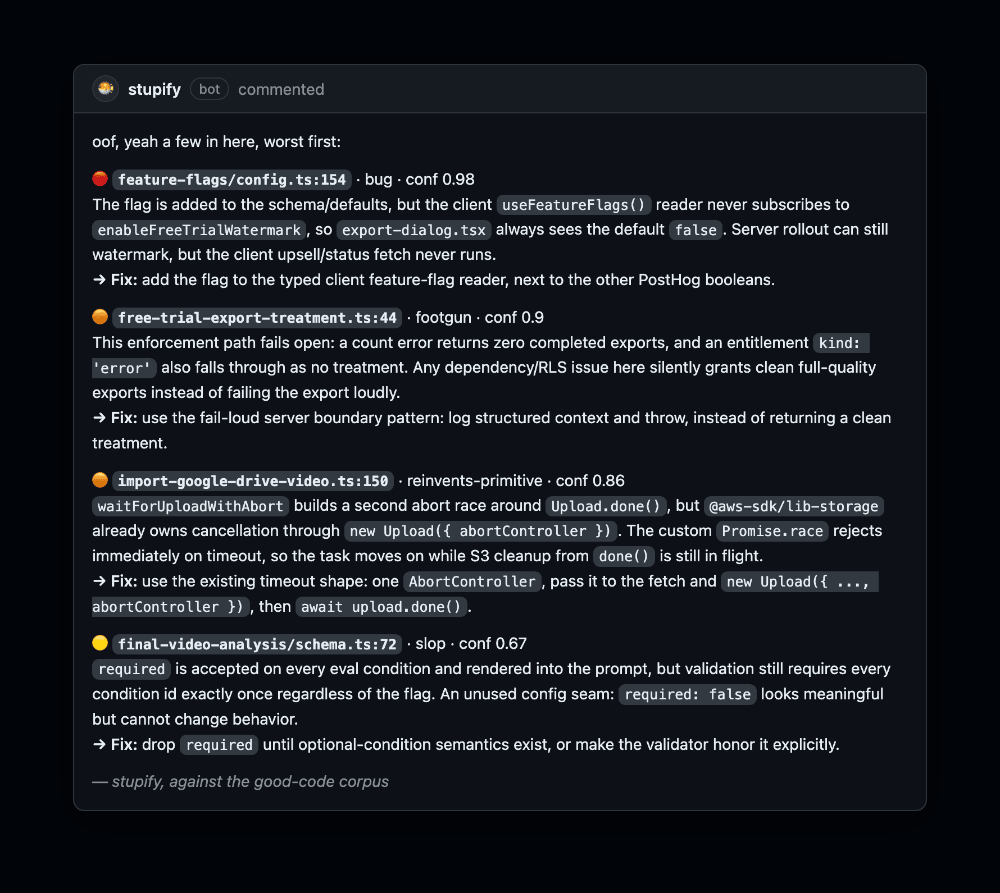

> Debugging is twice as hard as writing the code in the first place. Therefore, if you write the code as
> cleverly as possible, you are, by definition, not smart enough to debug it.
>
> **Kernighan's Law**

# stupify

**AI agents are rats in a maze. They reach for what they know.** And unless you show them better, what they know is slop: [most software is garbage](https://github.com/openai/codex/issues/28224), and they'll [happily](https://github.com/thesysdev/openui/issues/517) [imitate](https://github.com/RsyncProject/rsync/issues/929) [it](https://github.com/anthropics/claudes-c-compiler/issues/1).

[](LICENSE)



_actual issues, tells the coding agent exactly how + what to fix_ **[more catches, on real PRs →](docs/PROOF.md)**

### What you get

- **Your taste, not the model's.** Code is judged against a `CORPUS.md` of your own best files
- **On your personal Codex plan.** stupify reviews with [Codex](https://github.com/openai/codex), running on the $20-$200/month plan. API usage is roughly 50x more expensive, enjoy the subsidized tokens while they last
- **Slop, named.** Code review is cheap. Taste is expensive. Codify the goodies, let the LLM pattern match

## Run it

stupify is one Bun file on a cron, next to a `config.env`. It rides [exe.dev](https://exe.dev): a GitHub
integration proxies `gh` and the `llm` integration fronts your ChatGPT plan for codex, so the box holds no tokens.

```bash
git clone https://github.com/Octember/stupify && cd stupify && bun install
ssh exe.dev integrations add github --name stupify-acme-widgets --repository acme/widgets
ssh exe.dev new --name stupify-acme-widgets --integration stupify-acme-widgets --setup-script /dev/stdin < deploy/vm-setup.sh
ssh exe.dev integrations attach llm vm:stupify-acme-widgets
deploy/push.sh stupify-acme-widgets acme/widgets stupify-acme-widgets.int.exe.xyz
```

Open a PR and it's reviewed within a minute. Runbook, every knob, and how to read the log: [DEPLOY.md](DEPLOY.md).

## Your taste

A `.review/` in the repo it reviews: `REVIEW-PROMPT.md` (the spec), `RUBRIC.md` (what counts as slop), and
`CORPUS.md` (the code yours should look like). Start from this repo's own, then point `CORPUS.md` at the files you
_wish_ all your code looked like, with one line each on why.

## License

[MIT](LICENSE) © Noah Lindner. Built by the team at [Bevyl](https://bevyl.ai). `stupif.ai`, read it "stupify". PRs welcome, it'll review them 😈
