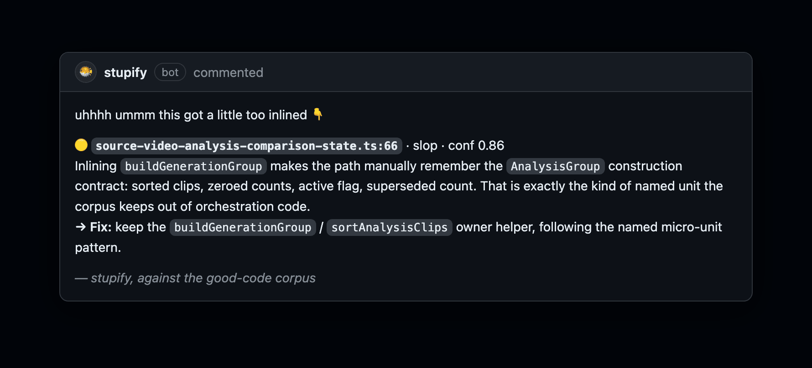
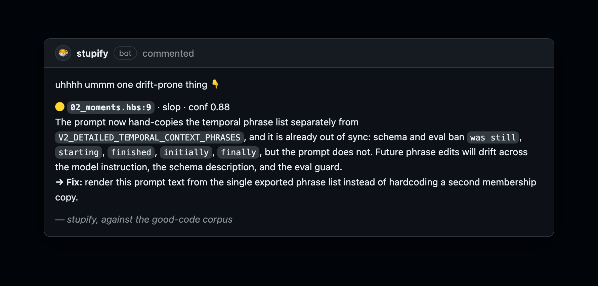

# stupify in the wild

Slop is the code that compiles fine, passes a human skim, and quietly rots: a primitive reinvented, a helper
inlined, a config seam that does nothing. A linter cannot see it because nothing is technically wrong. Here is
stupify catching it on real PRs, each finding naming the corpus primitive to use instead.

---

### It catches a named helper dissolved into call sites

A helper got inlined, so the call site now manually remembers a whole construction contract: sorted clips, zeroed
counts, active flag, superseded count. That is the kind of named unit the corpus keeps out of orchestration code.

---

### It spots a hand-rolled state machine

A `WriteStream` and three boolean flags to do what `.output(path)` already does, in the same file. Bigger, with
more ways to get the finish ordering wrong, for no new behavior.

---

### It catches duplicated data that is already drifting

A phrase list got hand-copied into a prompt instead of rendered from the one exported source, and it is already
out of sync with the schema and the eval guard. Two copies, one of them already wrong.

---

### It pushes for states that can't go wrong

Two parallel nullable fields let the schema hold an impossible half-link. One nullable object makes the malformed
state impossible to write in the first place.

---

### And it stops when the work is done

The whole PR thread is its memory, so once the findings are addressed it posts one line and goes quiet. The
opposite of a bot that re-nags on every push.
