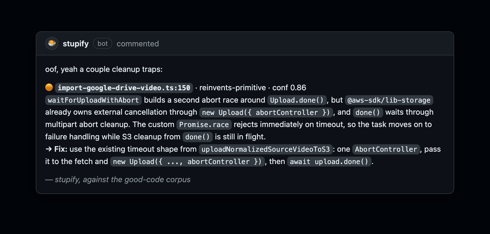
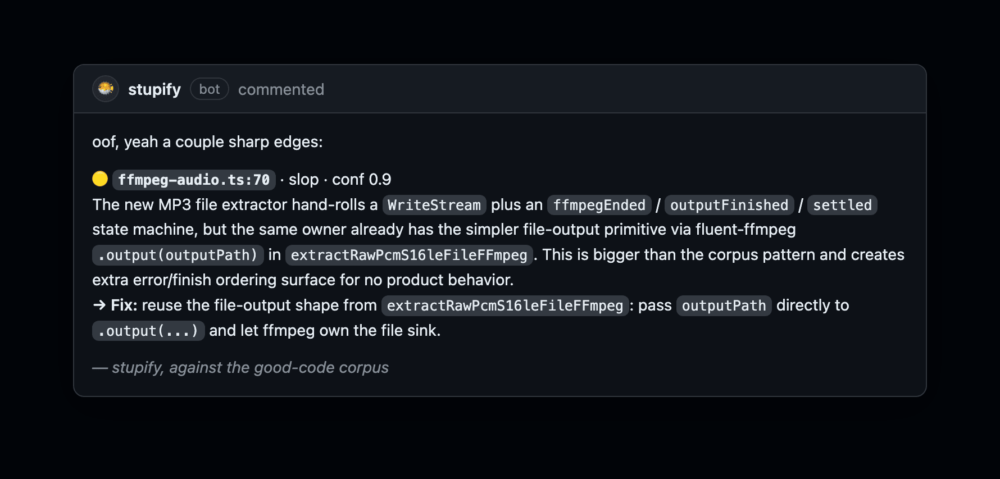
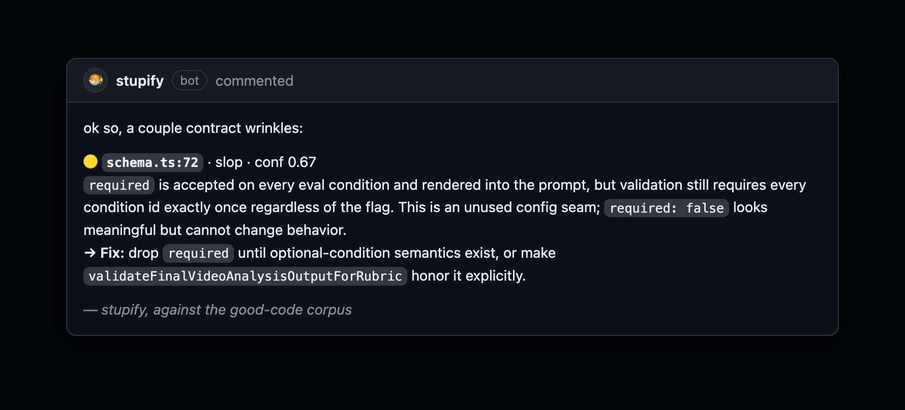
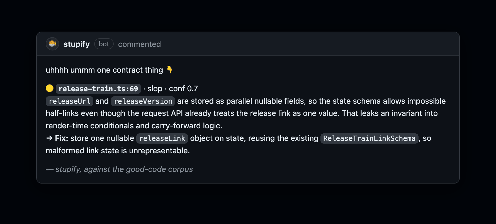

# stupify in the wild

Slop is the code that compiles fine, passes a human skim, and quietly rots: a primitive reinvented, a helper
inlined, a config seam that does nothing. A linter cannot see it because nothing is technically wrong. Here is
stupify catching it on real PRs, each finding naming the corpus primitive to use instead.

---

### It knows the library already does this

A second abort race hand-built around the AWS SDK's own cancellation. The reinvention also races wrong: the task
bails to failure handling while S3 cleanup is still in flight. Taste and a real bug in one finding.

---

### It spots a hand-rolled state machine

A `WriteStream` and three boolean flags to do what `.output(path)` already does, in the same file. Bigger, with
more ways to get the finish ordering wrong, for no new behavior.

---

### It catches the config seam that does nothing

`required` is accepted and rendered into the prompt, but validation ignores it. It looks meaningful; it cannot
change behavior. Most reviewers skim right past it.

---

### It pushes for states that can't go wrong

Two parallel nullable fields let the schema hold an impossible half-link. One nullable object makes the malformed
state impossible to write in the first place.

---

### And it stops when the work is done

The whole PR thread is its memory, so once the findings are addressed it posts one line and goes quiet. The
opposite of a bot that re-nags on every push.
