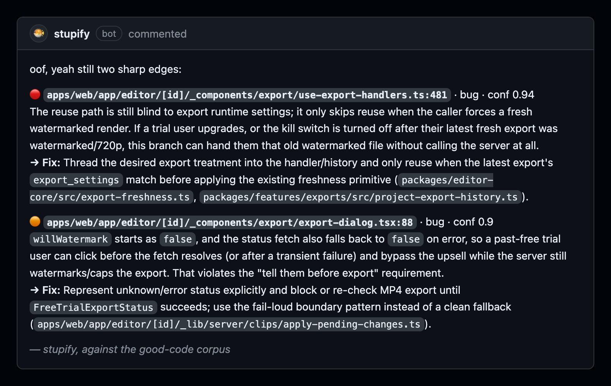

# stupify in the wild

Real reviews, verbatim from a real PR thread — one billing-critical feature (free-trial export watermark + 720p
cap), reviewed end to end. Worst-first findings, a human acting on them, and the judgment to stop when it's done.

---

### 1 · It catches real, high-stakes bugs

A feature flag wired into the schema but never read client-side — so trial users would get clean exports, a
revenue leak — plus a server seam that fails *open* to a full-res render, a reuse path that hands back the wrong
file, and a double-submit race. Four findings, each naming the corpus primitive to reuse.

---

### 2 · The engineer acts on it

All four, addressed.

---

### 3 · …and it catches the *incomplete* fix

The part most AI reviewers miss. It re-reads the fix and catches that the reuse path is **still** blind to runtime
settings (conf 0.94). It's not a rubber stamp — it tracks the fix across pushes until it's actually right.

---

### 4 · It knows when to stop

Once everything's addressed, it converges — instead of nagging. The whole thread is its memory, so the Nth review
only covers the delta. The #1 reason teams mute review bots is noise; this is the opposite.
