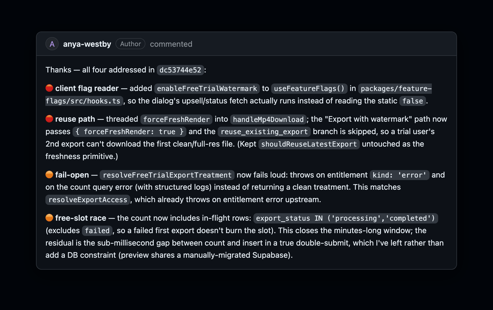

# stupify in the wild

Real reviews on real PRs — not mockups. *(Same engine stupify ships; a few were posted before the rename and
sign "codex" — same guts.)*

---

### It catches real, high-stakes bugs

On a billing-critical PR (free-trial watermark + 720p cap): a feature flag never read client-side — so trial users
would get clean exports — plus a server seam that fails *open* to a full-res render, a reuse path that hands back
the wrong file, and a double-submit race. Four findings, worst-first, each naming the corpus primitive to reuse.

---

### The engineer acts on it — and it catches the incomplete fix

This is the part most AI reviewers miss. The engineer fixes all four — and stupify re-reviews and catches that
*one fix is still incomplete*: "the reuse path is still blind to runtime settings." Not a rubber stamp.

---

### It knows when to stop

Once everything's addressed, it converges — `no new blocking issues — prior items addressed ✅` — instead of
nagging. The #1 reason teams mute review bots is noise; stupify keeps the whole thread as memory, so the Nth review
only covers the delta.
